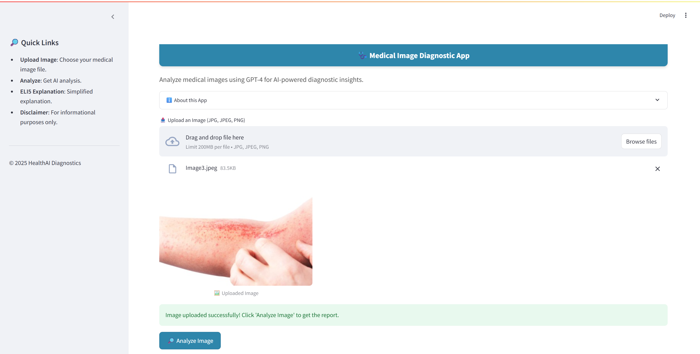
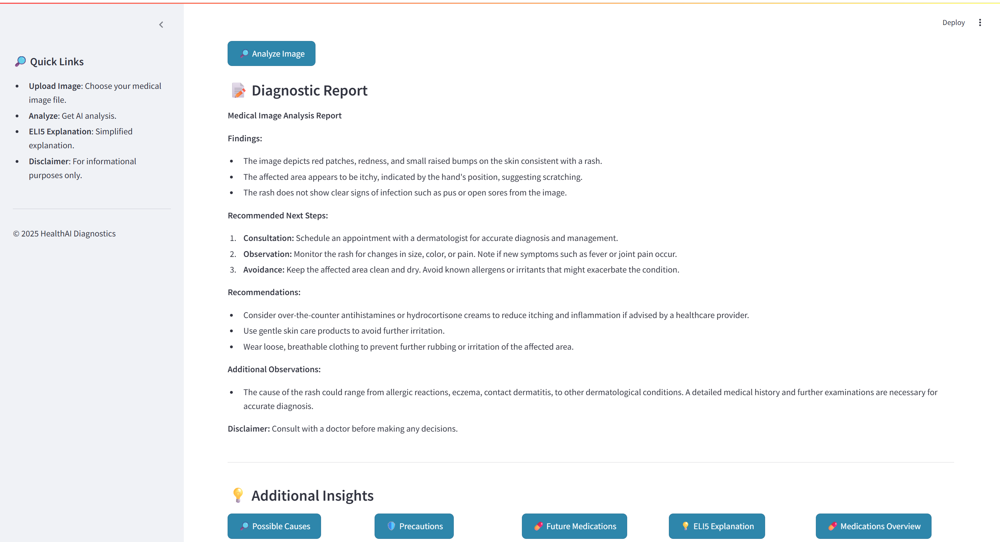

# 🩺 Medical Image Diagnostic App

A Streamlit-based web application that uses OpenAI’s GPT-4 model to analyze medical images, generate diagnostic reports, and provide recommendations for healthcare professionals.  

---

## 📌 Problem Statement

Skin diseases and rashes are among the most common medical conditions globally. Early diagnosis and effective management of these conditions can significantly improve patient outcomes. However, access to dermatologists or specialists might be limited, and initial triaging of symptoms can be challenging.

**This application aims to bridge that gap** by using AI-powered analysis to assist healthcare professionals in:
- Preliminary identification of potential diseases or conditions.
- Understanding possible causes of symptoms.
- Recommending appropriate next steps and medications.
- Providing easy-to-understand explanations for patients.

⚠️ **Note**: This tool is not a replacement for professional medical advice. It is intended to assist, not substitute, clinical decision-making.

---

## 🎯 Objectives

1. Provide a platform for uploading medical images (JPG, JPEG, PNG) of skin conditions.
2. Analyze the images using GPT-4 and generate a detailed diagnostic report including:
   - Findings
   - Recommended next steps
   - Recommendations
   - Additional observations
3. Offer additional insights through dedicated buttons:
   - **Possible Causes**: List potential underlying causes of the condition.
   - **Precautions**: Recommend steps to avoid worsening the condition.
   - **Future Medications**: Suggest potential treatments.
   - **ELI5 Explanation**: Explain the results in simple language for patients.
   - **Medications Overview**: Provide a quick summary of tablets, ointments, and other treatments to help doctors with decision-making.

---

## 🛠️ Key Features and Flow

### 🖼️ Image Upload
- Users can upload high-resolution images of skin conditions.
- Supported formats: `.jpg`, `.jpeg`, `.png`.
- The app uses `tempfile` to handle uploaded images securely and efficiently.
- **Code Snippet**:
    ```python
    uploaded_file = st.file_uploader("📤 Upload an Image (JPG, JPEG, PNG)", type=["jpg", "jpeg", "png"])
    ```
- Images are displayed with controlled width to avoid consuming too much screen space.


---

### 🔍 Analyze Image Button
- Users click **Analyze Image** to initiate AI analysis.
- The app encodes the uploaded image in base64 and sends it to the OpenAI API using GPT-4 with a sample diagnostic prompt.
- GPT-4 processes the image and generates a comprehensive diagnostic report including:
  - Findings
  - Next steps
  - Recommendations
  - Additional observations
- **Code Snippet**:
    ```python
    if st.button('🔎 Analyze Image'):
        result = call_gpt4_model_for_analysis(filename)
        st.session_state['result'] = result
    ```
- The result is displayed in markdown format, supporting rich text and bullet points.

---

### 📑 Diagnostic Report Section
- Displays the AI-generated diagnostic report to the user.
- Highlights key information:
  - **Findings**: Visual observations (e.g., redness, swelling, rash).
  - **Recommended Next Steps**: Suggests consultation, monitoring, avoidance.
  - **Recommendations**: E.g., skincare products, loose clothing.
  - **Additional Observations**: Any other relevant notes.
- Includes a **disclaimer** at the end:
  > "Consult with a doctor before making any decisions."

---

### 💡 Additional Insights Buttons

Each button triggers a specific prompt to GPT-3.5 to provide detailed guidance:

#### 🔎 Possible Causes
- Suggests potential medical reasons for the observed symptoms (e.g., eczema, allergic reactions).
- **Use Case**: Helps the doctor consider differential diagnoses.

#### 🛡️ Precautions
- Advises the user on immediate steps to prevent worsening of the condition.
- **Use Case**: Essential for patient safety and preventing complications.

#### 💊 Future Medications
- Recommends possible treatments for managing the condition, including over-the-counter options and specialist referrals.
- **Use Case**: Supports the doctor in planning therapy options.

#### 💡 ELI5 Explanation
- Converts the technical report into simple, patient-friendly language.
- **Use Case**: Enhances patient understanding and engagement.

#### 💊 Medications Overview
- Lists tablets, ointments, and other relevant medications including approximate usage.
- **Use Case**: Provides a quick reference guide for the doctor, aiding in decision-making and prescriptions.


---

## ⚕️ Medical Sector Applications

✅ **Decision Support Tool**  
- Doctors can use this app to get an AI-powered second opinion on rashes or skin conditions.
- Aids primary care physicians or nurses in initial triaging, especially in remote areas.

✅ **Patient Education**  
- ELI5 explanations empower patients to understand their conditions better.
- Supports telemedicine consultations by providing structured reports.

✅ **Training Resource**  
- Can be used in dermatology training programs to teach students about differential diagnosis, recommended treatments, and patient communication.

---

## 🛠️ Key Libraries

- **Streamlit**: For building interactive UI.
- **OpenAI**: For GPT-4 and GPT-3.5 API calls.
- **dotenv**: For secure API key management.
- **base64**: For encoding images.
- **tempfile**: For safe image handling.

---

